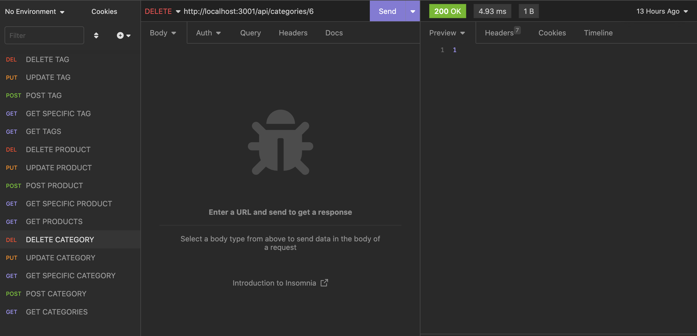
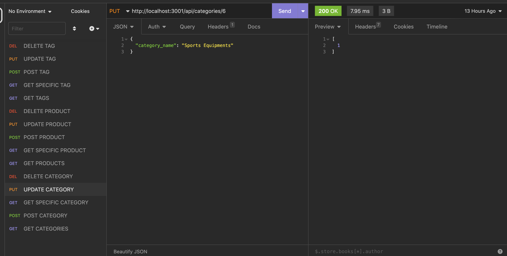
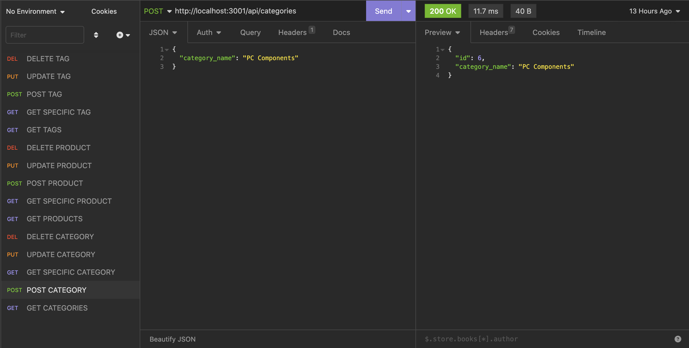
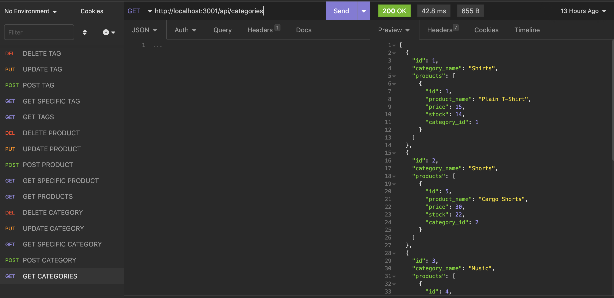

# e-commerce-application-

# Description

 This project creates the back-end for an e-commerce website. A working Express.js API has been configured to use Sequelize to interact with a MySQL database.

# Installation

Clone the e-commerce-application- repository to your local machine. The npm run seed command is used to seed the database and then start the server using node server.js command

# Screenshot 
The following screenshot demonstrates the application functionality:

# Link to Walk-through Video
https://drive.google.com/file/d/1aH5bw8V9E-KI3jDn9M4Xfwg_XJCZS6Be/view
